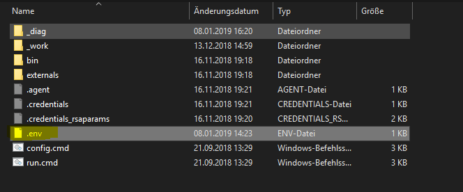
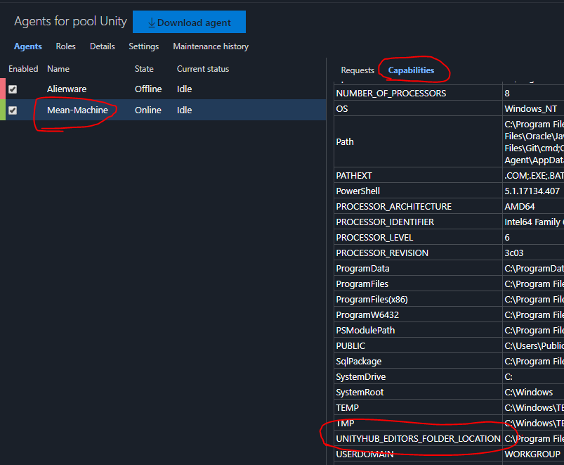

## Setup Custom Windows Agent

Please follow the official documentation on how to ["Deploy an agent on Windows"](https://docs.microsoft.com/en-us/azure/devops/pipelines/agents/v2-windows?view=vsts) for use in your Azure DevOps organization. Once you have done that, please navigate the Windows Explorer to the agent's root directory and create a `.env` file, if it does not exist yet.

Once you have the file in place, open it for editing in a text editor and add the environment variable `UNITYHUB_EDITORS_FOLDER_LOCATION` to it and set the value to the path where all your editors can be found.

Now that you have configured the agent's environment variables as needed for the Unity build task to work, you can start the agent. Open a Windows PowerShell window and navigate to the agent's root directory. Then type:

`.\run`

to run the agent. If your agent was already running, make sure to restart it properly for the change to take effect. Open your Azure DevOps organization in a browser of your choice and in the `Organization settings` under `Agent pools` select your agent pool and find the right agent. Verify it's online and under capabilities verify it has the Unity editors folder location environment variable set.

Congratulations! Your agent is now ready to build Unity projects.
